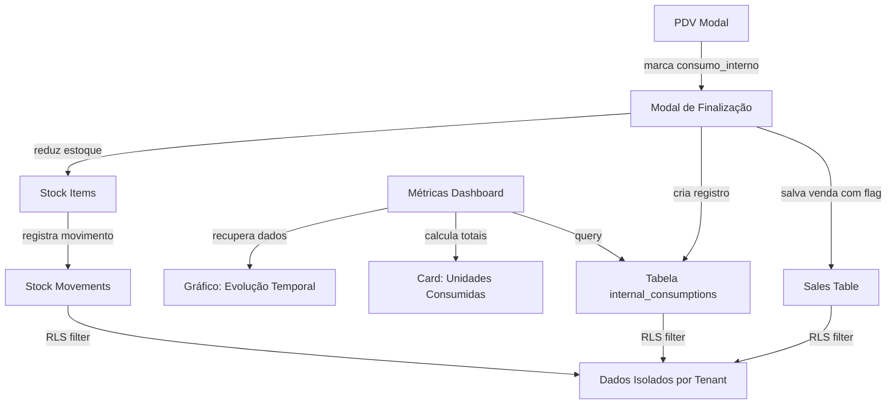
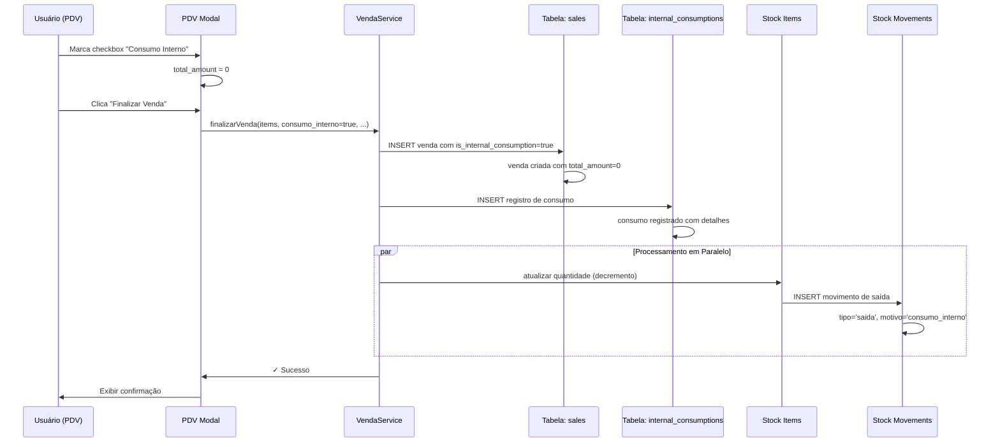
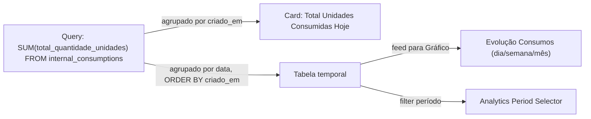

# Design Document: Consumo Interno no PDV

## Overview

A funcionalidade "Consumo Interno" permite que produtos vendidos através do PDV sejam marcados como consumo interno da instituição, resultando em valor de venda $0,00 sem cobrança. O sistema faz a baixa de estoque normalmente (como uma venda comum) mas registra esses consumos em tabela separada para rastreamento e análise. Novos cards e gráficos nas métricas permitem visualizar evolução de consumos internos ao longo do tempo.

## Architecture



## Components and Interfaces

### 1. Modal de Finalização de Pedido (PDV) - UI Enhancement

**Mudanças na interface existente**:
- Adicionar checkbox "Consumo Interno" no modal de pagamento
- Aplicar lógica de habilitação/desabilitação do checkbox baseado em estado de venda
- Quando marcado: desabilitar campos de seleção de cliente e forma de pagamento
- Quando marcado: forçar total_amount = 0
- Validação: não permitir "Consumo Interno" sem itens no carrinho

```pseudocode
INTERFACE PDVFinalizacaoModal
  - checkbox: consumo_interno (boolean, default false)
  - campo: total_amount (NUMERIC, computed)
  - campo: cliente_nome (text, required if NOT consumo_interno)
  - campo: forma_pagamento (enum, required if NOT consumo_interno)
  - campo: valor_troco (NUMERIC, required if needs_change AND NOT consumo_interno)
  - botão: finalizar()
END INTERFACE
```

**Validações**:
- IF consumo_interno = true THEN total_amount MUST equal 0
- IF consumo_interno = true THEN cliente_nome MUST be null or empty
- IF consumo_interno = true THEN payment_method MUST be null or fixed value
- IF consumo_interno = true THEN items array MUST NOT be empty

### 2. Fluxo de Dados na Finalização



### 3. Estrutura de Dados - Tabela `internal_consumptions`

A tabela `internal_consumptions` armazena consumos internos com rastreamento completo:

```pseudocode
TABLE internal_consumptions
  id: UUID (PK)
  estabelecimento_id: UUID (FK establishments, NOT NULL)
  sale_id: UUID (FK sales, NOT NULL)
  
  -- Itens consumidos (desnormalizado para performance em gráficos)
  items_json: JSONB [
    {
      product_id: UUID,
      product_nome: VARCHAR,
      quantidade: INTEGER,
      preco_unitario: DECIMAL,
      subtotal: DECIMAL (quantidade * preco_unitario)
    }
  ]
  
  -- Totalizações
  total_quantidade_unidades: INTEGER
  total_valor_custo: DECIMAL (se necessário rastreamento de cost)
  
  -- Metadados
  usuario_id: UUID (FK auth.users)
  notas: TEXT (opcional, ex: motivo do consumo)
  
  -- Timestamps
  criado_em: TIMESTAMPTZ
  
  -- RLS
  CONSTRAINT rls_establecimiento_id NOT NULL
END TABLE

INDEXES
  - idx_internal_consumptions_estabelecimento_id
  - idx_internal_consumptions_sale_id
  - idx_internal_consumptions_criado_em DESC
  - idx_internal_consumptions_usuario_id
END INDEXES
```

**Notas sobre design**:
- `is_internal_consumption: BOOLEAN` é adicionado à tabela `sales` (não é coluna nova na consumptions, é flag na sales)
- `internal_consumptions` apenas armazena referência e é consultada para relatórios
- Items desnormalizado em JSON permite queries rápidas sem JOIN (analise temporal)
- `estabelecimento_id` garante RLS: cada tenant vê apenas consumos do seu estabelecimento

### 4. Modificações na Tabela `sales`

Adicionar coluna booleana à tabela existente `sales`:

```pseudocode
ALTER TABLE sales ADD COLUMN
  is_internal_consumption: BOOLEAN DEFAULT false
  
-- Índice para queries de consumos internos
CREATE INDEX idx_sales_is_internal_consumption ON sales (is_internal_consumption)
  WHERE is_internal_consumption = true
END
```

### 5. Fluxo de Geração de Dados para Métricas



### 6. Componentes de Métricas

#### 6.1 Card: "Unidades Consumidas Internamente"

```pseudocode
COMPONENT InternalConsumptionCard
  INPUT
    estabelecimento_id: UUID
    periodo: 'hoje' | 'semana' | 'mes' | 'ano'
  
  QUERIES
    - SELECT SUM(total_quantidade_unidades) 
      FROM internal_consumptions
      WHERE estabelecimento_id = :eid
        AND criado_em >= DATE_TRUNC(:periodo, now())
  
  OUTPUT
    - number: total_unidades
    - badge: "consumos registrados"
    - trend: (opcional) variação vs período anterior
END COMPONENT
```

**Localização**: Dashboard / Métricas, ao lado de "Vendas do PDV"

**Validações**:
- Retornar 0 se nenhum consumo no período
- Cachedadmin para 5 minutos (performance)

#### 6.2 Gráfico: "Evolução de Consumos Internos"

```pseudocode
COMPONENT EvolutionGraphic
  INPUT
    estabelecimento_id: UUID
    periodo: 'ultima_semana' | 'ultimo_mes' | 'ultimos_3_meses'
    tipo_agrupamento: 'dia' | 'semana' | 'mes'
  
  QUERIES
    - SELECT DATE_TRUNC(:agrupamento, criado_em) as data_grupo,
             SUM(total_quantidade_unidades) as total
      FROM internal_consumptions
      WHERE estabelecimento_id = :eid
        AND criado_em >= NOW() - :periodo
      GROUP BY data_grupo
      ORDER BY data_grupo ASC
  
  OUTPUT
    - recharts.LineChart OR BarChart
    - eixo X: data_grupo
    - eixo Y: total unidades
    - tooltip: data + total
END COMPONENT
```

**Localização**: Página de Analytics > Aba "Consumos Internos"

**Tipo de gráfico**: LineChart (recharts) para tendência visual

### 7. Componentes de Serviço (Backend Logic)

#### 7.1 Função RPC: `registrar_consumo_interno`

```pseudocode
FUNCTION registrar_consumo_interno(
  items_array JSONB,
  usuario_id UUID,
  estabelecimento_id UUID,
  notas TEXT
) RETURNS JSON AS $$
BEGIN
  -- 1. Validar: items_array não vazio
  IF items_array IS NULL OR jsonb_array_length(items_array) = 0 THEN
    RAISE EXCEPTION 'Items array cannot be empty';
  END IF;
  
  -- 2. Iniciar transação
  BEGIN
    -- 3. Inserir venda com is_internal_consumption = true
    INSERT INTO sales (
      sale_number, total_amount, payment_method, 
      sale_type, items, is_internal_consumption,
      created_by, estabelecimento_id, created_at
    ) VALUES (
      'CONS-' || TO_CHAR(NOW(), 'YYYYMMDD-HH24MISS'),
      0.00, 'INTERNAL', 'INTERNAL_CONSUMPTION',
      items_array, true,
      usuario_id, estabelecimento_id, NOW()
    ) RETURNING id INTO sale_id;
    
    -- 4. Calcular total_quantidade_unidades e total_valor_custo
    SELECT 
      SUM((item->>'quantidade')::INTEGER),
      SUM((item->>'quantidade')::INTEGER * (item->>'preco_unitario')::DECIMAL)
    INTO total_qtd, total_cost
    FROM jsonb_array_elements(items_array) AS item;
    
    -- 5. Inserir em internal_consumptions
    INSERT INTO internal_consumptions (
      estabelecimento_id, sale_id, items_json, 
      total_quantidade_unidades, total_valor_custo,
      usuario_id, notas, criado_em
    ) VALUES (
      estabelecimento_id, sale_id, items_array,
      total_qtd, total_cost,
      usuario_id, notas, NOW()
    ) RETURNING id INTO consumption_id;
    
    -- 6. Para cada item: fazer baixa de estoque
    FOR item IN SELECT * FROM jsonb_array_elements(items_array)
    LOOP
      -- 6.1 Atualizar stock_items
      UPDATE stock_items
      SET quantidade = quantidade - (item->>'quantidade')::INTEGER,
          atualizado_em = NOW()
      WHERE product_id = (item->>'product_id')::UUID
        AND estabelecimento_id = estabelecimento_id;
      
      -- 6.2 Registrar movimento
      INSERT INTO stock_movements (
        stock_item_id, tipo, quantidade, motivo, usuario_id,
        ref_type, ref_id, criado_em, estabelecimento_id
      ) VALUES (
        (SELECT id FROM stock_items WHERE product_id = (item->>'product_id')::UUID),
        'saida', (item->>'quantidade')::INTEGER,
        'Consumo Interno', usuario_id,
        'INTERNAL_CONSUMPTION', consumption_id, NOW(), estabelecimento_id
      );
    END LOOP;
    
    -- 7. Retornar sucesso
    RETURN json_build_object(
      'sucesso', true,
      'sale_id', sale_id,
      'consumption_id', consumption_id,
      'total_unidades', total_qtd
    );
  EXCEPTION WHEN OTHERS THEN
    -- Rollback automático
    RETURN json_build_object(
      'sucesso', false,
      'erro', SQLERRM
    );
  END;
END;
$$ LANGUAGE plpgsql;
```

#### 7.2 Função Query: `obter_consumos_por_periodo`

```pseudocode
FUNCTION obter_consumos_por_periodo(
  estabelecimento_id UUID,
  data_inicio DATE,
  data_fim DATE,
  agrupamento TEXT DEFAULT 'dia'
) RETURNS TABLE (
  data_grupo TIMESTAMPTZ,
  total_unidades BIGINT,
  total_consumos INT
) AS $$
BEGIN
  RETURN QUERY
  SELECT 
    DATE_TRUNC(agrupamento, criado_em) as data_grupo,
    SUM(total_quantidade_unidades) as total_unidades,
    COUNT(*) as total_consumos
  FROM internal_consumptions
  WHERE estabelecimento_id = estabelecimento_id
    AND criado_em >= data_inicio
    AND criado_em < data_fim + INTERVAL '1 day'
  GROUP BY DATE_TRUNC(agrupamento, criado_em)
  ORDER BY data_grupo ASC;
END;
$$ LANGUAGE plpgsql;
```

### 8. Camada de Isolamento (RLS)

As políticas RLS abaixo garantem que usuários vejam apenas consumos do seu estabelecimento:

```pseudocode
-- Habilitar RLS na tabela internal_consumptions
ALTER TABLE internal_consumptions ENABLE ROW LEVEL SECURITY;

-- Política SELECT: usuário vê consumos do próprio estabelecimento
CREATE POLICY internal_consumptions_select ON internal_consumptions
  FOR SELECT TO authenticated
  USING (estabelecimento_id IN (
    SELECT id FROM estabelecimentos WHERE id = 
      get_user_estabelecimento_id(auth.uid())
  ));

-- Política INSERT: usuário cria consumos no próprio estabelecimento
CREATE POLICY internal_consumptions_insert ON internal_consumptions
  FOR INSERT TO authenticated
  WITH CHECK (estabelecimento_id IN (
    SELECT id FROM estabelecimentos WHERE id = 
      get_user_estabelecimento_id(auth.uid())
  ));

-- Sem DELETE/UPDATE para manter auditoria
END POLICIES
```

## Data Models

### Model 1: Internal Consumption

```pseudocode
INTERFACE InternalConsumption
  id: UUID
  estabelecimento_id: UUID
  sale_id: UUID (referência à venda)
  items_json: JSONB [
    {
      product_id: UUID,
      product_nome: VARCHAR,
      quantidade: INTEGER,
      preco_unitario: DECIMAL,
      subtotal: DECIMAL
    }
  ]
  total_quantidade_unidades: INTEGER
  total_valor_custo: DECIMAL (opcional)
  usuario_id: UUID
  notas: TEXT
  criado_em: TIMESTAMPTZ
END INTERFACE
```

### Model 2: Venda com Consumo Interno

```pseudocode
INTERFACE Sale (modificada)
  id: UUID
  sale_number: VARCHAR
  total_amount: DECIMAL (0.00 se is_internal_consumption)
  payment_method: VARCHAR (null ou 'INTERNAL' se consumo)
  is_internal_consumption: BOOLEAN (nova coluna)
  items: JSONB
  created_by: UUID
  estabelecimento_id: UUID
  created_at: TIMESTAMPTZ
END INTERFACE
```

## Error Handling

### Cenário 1: Tentativa de Consumo Interno Sem Itens

**Condição**: Usuário marca checkbox "Consumo Interno" mas carrinho vazio

**Resposta**: Desabilitar checkbox e/ou exibir mensagem de erro

**Recovery**: Limpar o flag, exibir aviso "Adicione itens antes de marcar como consumo interno"

### Cenário 2: Falha ao Criar Consumo (Erro de Banco)

**Condição**: INSERT em `internal_consumptions` falha durante transação

**Resposta**: Fazer rollback completo (RPC garante atomicidade)

**Recovery**: Exibir erro genérico ao usuário ("Falha ao registrar consumo. Tente novamente."), log detalhado no servidor

### Cenário 3: Inconsistência de Estoque

**Condição**: Quantidade disponível é menor que a sendo consumida

**Resposta**: Permitir mesmo assim (consumo interno é autorizado até mesmo com estoque negativo, caso necessário)

**Recovery**: Exibir aviso de estoque baixo após consumo

### Cenário 4: RLS Violation (Acesso não autorizado)

**Condição**: Usuário tenta acessar consumos de outro estabelecimento

**Resposta**: PostgreSQL nega SELECT (retorna vazio) e nega INSERT/UPDATE (erro de autorização)

**Recovery**: Redirecionar para página inicial, exibir mensagem de acesso negado

## Testing Strategy

### Unit Testing Approach

**Testes de lógica de validação**:
1. Checkbox "Consumo Interno" não pode ser marcado sem itens
2. total_amount é forçado a 0 quando consumo_interno = true
3. Campos de cliente e pagamento são desabilitados quando consumo_interno = true

**Testes de cálculo**:
1. total_quantidade_unidades é calculado corretamente como SUM(item.quantidade)
2. total_valor_custo é calculado corretamente como SUM(item.quantidade * item.preco_unitario)

**Testes de isolamento de tenant**:
1. Consumo criado por usuário de tenant A não é visível para usuário de tenant B
2. Consulta de métricas respeita estabelecimento_id

### Property-Based Testing Approach

**Property Test Library**: fast-check (JavaScript/TypeScript)

**Property 1: Consumo sem duplicação**
*For any* lista de items válida, após criar um consumo interno, exatamente um registro deve existir em `internal_consumptions` com `sale_id` único

**Property 2: Estoque reduzido consistentemente**
*For any* consumo interno criado, a quantidade de cada produto em `stock_items` deve ser reduzida por exatamente a quantidade consumida

**Property 3: Movimento registrado corretamente**
*For any* consumo interno criado, deve existir exatamente um `stock_movement` com `tipo='saida'` e `ref_type='INTERNAL_CONSUMPTION'` para cada produto consumido

**Property 4: Total não negativo**
*For any* consumo interno registrado, `total_quantidade_unidades` deve ser >= 0 e `total_valor_custo` deve ser >= 0

**Property 5: Determinismo de cálculo**
*For any* items array, a função `registrar_consumo_interno` chamada 2 vezes com mesmos parâmetros deve produzir `total_quantidade_unidades` idêntico

### Integration Testing Approach

**Teste end-to-end (PDV → Banco → Métricas)**:
1. Usuário marca consumo interno e finaliza venda
2. Venda é criada com `is_internal_consumption=true` e `total_amount=0`
3. Consumo é registrado em `internal_consumptions`
4. Estoque é reduzido corretamente
5. Card de métricas reflete novo total de unidades consumidas

## Performance Considerations

1. **Desnormalização em internal_consumptions**: Campo `items_json` armazena dados de forma plana para evitar JOINs em queries de gráficos

2. **Índices estratégicos**:
   - `idx_internal_consumptions_estabelecimento_id`: filtro primário por tenant
   - `idx_internal_consumptions_criado_em DESC`: ordenação temporal para gráficos

3. **Caching de métricas** (recomendado no frontend):
   - Card "Unidades Consumidas": cache de 5 minutos
   - Gráfico de evolução: cache de 15 minutos (recomputa com menos frequência)

4. **Funções RPC otimizadas**:
   - `registrar_consumo_interno` executa em transação única (atomicidade)
   - `obter_consumos_por_periodo` usa `DATE_TRUNC` (índice-friendly) e `SUM` agregado

## Security Considerations

1. **RLS por estabelecimento**: Cada consulta é automaticamente filtrada pelo `estabelecimento_id` do usuário autenticado

2. **Imutabilidade de auditoria**: Nenhum DELETE permitido em `internal_consumptions`, apenas INSERT/SELECT

3. **Validação de entrada**: 
   - Items array deve conter ao mínimo 1 item
   - Quantidades devem ser inteiros positivos
   - Preços devem ser DECIMAL válido

4. **Autorização por perfil**: 
   - Apenas "Operadores" e acima podem marcar consumo interno (não vendedor anônimo)
   - Usuários com Perfil "Operador" confinado ao seu estabelecimento

## Dependencies

- **Tabelas existentes**: `sales`, `stock_items`, `stock_movements`, `auth.users`, `estabelecimentos`
- **Infraestrutura Supabase**: Row Level Security, Funções PostgreSQL, Edge Functions
- **Frontend**: React Context para state, recharts para gráficos, shadcn/ui para componentes
- **Backend**: Supabase PostgreSQL, funções RPC em PL/pgSQL

## Correctness Properties

*A property é uma característica ou comportamento que deve ser verdadeira em todas as execuções válidas do sistema.*

### Property 1: Venda com Consumo Interno tem Total Zero

*For any* consumo interno registrado, a venda correspondente deve ter `total_amount = 0.00`

**Validates: Requirement 1.1 - Quando marcado, valor total fica R$ 0,00**

### Property 2: Estoque é Reduzido Após Consumo

*For any* consumo interno criado com items, a quantidade disponível em `stock_items` para cada produto deve ser reduzida por exatamente a quantidade consumida

**Validates: Requirement 1.2 - Fazer baixa no estoque normalmente**

### Property 3: Consumo é Rastreável e Único

*For any* consumo interno registrado, deve existir exatamente um registro em `internal_consumptions` vinculado à `sale_id` correspondente, com `is_internal_consumption = true`

**Validates: Requirement 1.3 - Registrar em tabela de consumos_internos para rastreamento**

### Property 4: Card de Métricas Reflete Total Correto

*For any* período de data, o total de unidades exibido no card "Unidades Consumidas Internamente" deve ser igual ao `SUM(total_quantidade_unidades)` de todos os consumos no período para o estabelecimento

**Validates: Requirement 1.4 - Exibir nas métricas novo card com total de unidades**

### Property 5: Gráfico Mostra Evolução Consistente

*For any* consumo interno criado, após sua criação, o gráfico de evolução deve incluir um ponto (data, quantidade) refletindo esse consumo no período correto

**Validates: Requirement 1.5 - Incluir gráfico/evolução de consumos internos ao longo do tempo**

### Property 6: Isolamento Multi-Tenant

*For any* usuário, consultando `internal_consumptions` ou `sales` com `is_internal_consumption=true`, apenas registros cujo `estabelecimento_id` corresponde ao estabelecimento do usuário devem ser retornados

**Validates: Requirement 1.5 - Multi-tenant com RLS**

### Property 7: Movimento de Estoque é Registrado

*For any* item consumido internamente, deve existir um registro em `stock_movements` com `tipo='saida'` e `ref_type='INTERNAL_CONSUMPTION'` e `quantidade` igual à quantidade consumida

**Validates: Requirement 1.2 - Fazer baixa no estoque**
