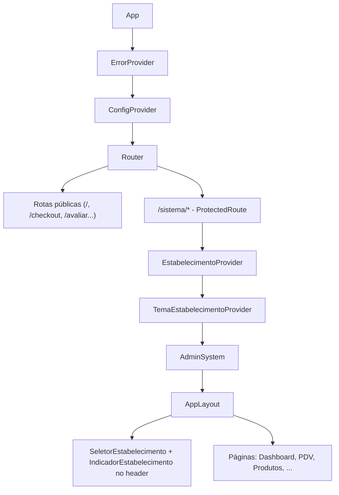
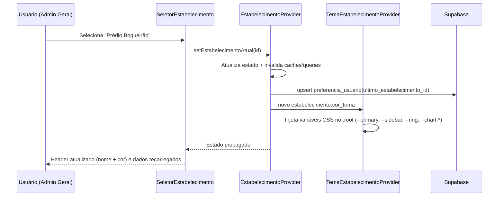
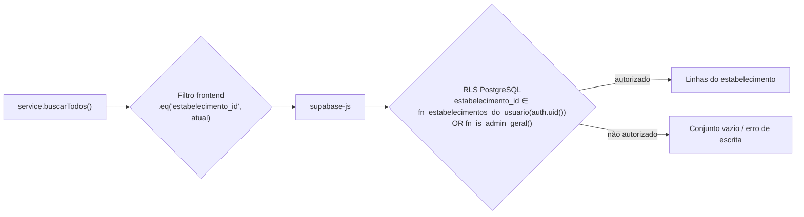

# Design Document

## Overview

Este documento descreve o design técnico para transformar o sistema "Casa do Pai" (atualmente single-tenant) em uma aplicação **multi-estabelecimento** (multi-tenant), atendendo aos requisitos descritos em `requirements.md`.

A estratégia central tem dois pilares:

1. **Autorização no banco (fonte de verdade)**: Row Level Security (RLS) do PostgreSQL determina **quais estabelecimentos** um usuário pode acessar — o(s) estabelecimento(s) vinculado(s), ou **todos** quando o perfil é `administrador_geral`. Isso é derivado de `auth.uid()` por meio de funções `SECURITY DEFINER` e uma tabela de vínculo, sem depender de claims customizadas no JWT nem de `set_config` por requisição.
2. **Escopo de exibição no frontend (conveniência)**: o `Estabelecimento_Atual` selecionado na sessão aplica um filtro `.eq('estabelecimento_id', atual)` nas consultas, controlando o que é exibido. Esse filtro **não é a barreira de segurança** — apenas decide qual dos estabelecimentos autorizados está em foco.

A implementação preserva as funcionalidades existentes (Req 11): adiciona uma camada de tenant sobre o sistema atual, mantém os fluxos de produtos, estoque, pedidos, PDV, comandas, delivery, avaliações e configurações, e migra os dados existentes para um estabelecimento padrão (Req 10).

### Princípios de design

- **Centralização**: a injeção de `estabelecimento_id` nas operações de dados é centralizada num helper/contexto para reduzir o risco de esquecimento (Req 5).
- **Mínima alteração de fluxo**: reaproveitar `ConfigContext`, `usePermissoes`, `authService` e o padrão de services existente em vez de reescrevê-los.
- **Defesa em profundidade**: RLS no banco + filtro no frontend + validação de perfil na UI.

## Architecture

### Composição de Providers (frontend)

A composição atual (`<ErrorProvider> > <ConfigProvider> > Router`) é estendida com dois novos providers: `EstabelecimentoProvider` (contexto do tenant atual e autorizados) e `TemaEstabelecimentoProvider` (aplica a identidade visual). O `EstabelecimentoProvider` precisa da sessão autenticada, então fica dentro da árvore protegida, mas o tema acompanha o estabelecimento atual.



### Fluxo de troca de estabelecimento (Req 3, 4, 6, 7)



### Fluxo de isolamento de dados (Req 5)



**Por que não usar JWT custom claims ou `set_config`:**

- **Custom claims no JWT**: exigiriam um Auth Hook (Custom Access Token Hook) e re-emissão do token a cada troca de estabelecimento — o que conflita com o requisito de "trocar sem reautenticar" (Req 3.8) e adiciona complexidade de invalidação. Além disso, o conjunto de estabelecimentos autorizados muda quando um admin cadastra usuários, exigindo refresh de token.
- **`set_config('app.current_estabelecimento', ...)` por requisição**: o `supabase-js` usa PostgREST sobre um pool de conexões; não há garantia de que o `SET` e a query subsequente rodem na mesma conexão, tornando o approach inseguro/instável.
- **Solução adotada**: a RLS deriva os estabelecimentos autorizados diretamente de `auth.uid()` consultando a tabela de vínculo via função `SECURITY DEFINER` (evita recursão de RLS). A autorização é sempre correta e dinâmica. O "estabelecimento atual" é puramente uma escolha de visualização do frontend, dentro do que já é permitido.

## Components and Interfaces

### 1. Camada de dados / tipos (TypeScript)

```typescript
// src/types/estabelecimento.ts
export type PerfilUsuario =
  | 'administrador_geral'
  | 'administrador_estabelecimento'
  | 'operador';

export interface Estabelecimento {
  id: string;
  nome: string;
  descricao: string | null;
  cor_tema: string;     // hex, ex: "#2563EB"
  ativo: boolean;
  criado_em: string;
}

export interface UsuarioEstabelecimento {
  id: string;
  user_id: string;            // auth.users(id)
  nome: string;
  email: string;
  perfil: PerfilUsuario;
  estabelecimento_id: string | null; // null para administrador_geral
  ativo: boolean;
  ultimo_estabelecimento_id: string | null;
  criado_em: string;
}

export interface LogAuditoria {
  id: string;
  usuario_id: string | null;
  estabelecimento_id: string | null;
  acao: string;               // ex: 'produto.atualizar', 'estabelecimento.trocar'
  descricao: string;          // ex: "Maria alterou produto X no Prédio CIC"
  metadata: Record<string, unknown> | null;
  criado_em: string;
}
```

### 2. EstabelecimentoContext / Provider

Responsável por: descobrir estabelecimentos autorizados do usuário, manter `estabelecimentoAtual`, permitir troca (apenas para `administrador_geral`), persistir a escolha e restaurá-la no login (Req 3, 4).

```typescript
// src/contexts/EstabelecimentoContext.tsx
interface EstabelecimentoContextType {
  estabelecimentoAtual: Estabelecimento | null;
  estabelecimentosAutorizados: Estabelecimento[];
  perfil: PerfilUsuario | null;
  podeTrocar: boolean;            // true somente para administrador_geral
  loading: boolean;
  erro: string | null;
  trocarEstabelecimento: (id: string) => Promise<void>;
  recarregar: () => Promise<void>;
}
```

Comportamento:
- No `mount` (dentro da rota protegida), carrega o registro do usuário (`usuarios_estabelecimento` por `auth.uid()`) e a lista de estabelecimentos ativos que a RLS retorna.
- `administrador_geral` → `estabelecimentosAutorizados` = todos ativos; `podeTrocar = true`.
- `administrador_estabelecimento` / `operador` → lista contém apenas o vinculado; `podeTrocar = false`.
- Define `estabelecimentoAtual`: último estabelecimento usado (se ativo) para admin geral; estabelecimento vinculado para os demais (Req 4.3, 4.4, 4.5).
- Se o usuário não tem nenhum estabelecimento ativo, expõe `erro` e bloqueia a renderização de dados de domínio (Req 4.6, 11.5).
- `trocarEstabelecimento`: atualiza estado, persiste `ultimo_estabelecimento_id`, registra auditoria de troca (Req 9.2) e dispara recarga de dados (ver seção de invalidação de cache).

### 3. TemaEstabelecimentoProvider (Req 6, 7)

Não há ThemeProvider hoje; o tema vive em variáveis CSS oklch no `:root` de `src/index.css`. Este provider observa `estabelecimentoAtual.cor_tema` e injeta sobrescritas em tempo de execução no elemento raiz.

```typescript
// src/contexts/TemaEstabelecimentoContext.tsx
// Converte a cor base (hex) em uma paleta e aplica via style do documentElement:
function aplicarTema(corHex: string) {
  const root = document.documentElement;
  const oklch = hexParaOklch(corHex);
  root.style.setProperty('--primary', oklch.base);
  root.style.setProperty('--ring', oklch.base);
  root.style.setProperty('--sidebar-primary', oklch.base);
  root.style.setProperty('--chart-1', oklch.base);
  root.style.setProperty('--admin-btn-primary-bg', oklch.base);
  root.style.setProperty('--price-color', oklch.base);
  // ...derivados (hover, accent) calculados a partir da base
}
```

- Aplicação simultânea e consistente aos elementos: cor principal, sidebar, botões, cards (via tokens), destaques, badges, gráficos e links ativos (Req 6.1).
- Atualização sem reload, ≤ 500 ms (Req 6.2) — alterar `style` do `:root` é instantâneo e propaga via cascata CSS.
- Cor ausente/ inválida → tema padrão + indicação visual (Req 6.5). Sem estabelecimento → tema neutro padrão (Req 6.6).
- A conversão hex→oklch usará um utilitário em `src/utils/cor.ts`. As variáveis padrão definidas em `index.css` permanecem como fallback.

### 4. SeletorEstabelecimento e IndicadorEstabelecimento (Req 3, 7)

Componentes no header (`AppLayout` desktop e `MobileAdminHeader`):

- `SeletorEstabelecimento`: usa `@radix-ui/react-select`. Para admin geral lista estabelecimentos ativos ordenados por nome (Req 3.1); estado vazio mostra mensagem (Req 3.2). Para demais perfis, modo somente leitura (Req 3.3).
- `IndicadorEstabelecimento`: badge fixo "🏢 Estabelecimento atual: NOME" usando `cor_tema` (Req 7.1, 7.2); estado sem seleção mostra aviso (Req 7.5).

### 5. Páginas novas (Configurações > Usuários e Estabelecimentos)

- `src/pages/Usuarios.tsx` + formulários: CRUD de usuários (nome, email, senha, ativo, estabelecimento vinculado, perfil) — Req 2. Admin geral gerencia todos; admin de estabelecimento só do próprio prédio e sem conceder `administrador_geral` (Req 2.8).
- `src/pages/Estabelecimentos.tsx` + formulário: CRUD de estabelecimentos (nome, descrição, cor_tema, ativo) — Req 1, somente `administrador_geral`.
- Novos itens no `menuItems` do `AppLayout` sob "Configurações", filtrados por perfil.
- Nova rota e página `src/pages/Auditoria.tsx` para o `logs_auditoria` (Req 9.4, 9.5).

### 6. Atualização de usePermissoes (perfil + estabelecimento)

`usePermissoes` passa a ler de `usuarios_estabelecimento` (com fallback para `profile`/`funcionarios` durante a transição), expondo também `perfil` e `estabelecimento_id`. As flags `podeAcessarX` existentes são preservadas; novas flags: `podeGerenciarEstabelecimentos`, `podeGerenciarUsuarios`, `podeTrocarEstabelecimento`, `podeVerAuditoria`.

### 7. Camada de serviços — injeção centralizada de tenant

Para evitar editar cada `.eq()`/`.insert()` manualmente e reduzir risco de falha (Req 5), introduz-se um helper que recebe o `estabelecimento_id` atual e o aplica de forma consistente:

```typescript
// src/services/tenant.ts
import { supabase } from '@/lib/supabase';

// Lê o estabelecimento atual de um store leve (setado pelo EstabelecimentoProvider)
let estabelecimentoAtualId: string | null = null;
export const setEstabelecimentoAtivo = (id: string | null) => { estabelecimentoAtualId = id; };
export const getEstabelecimentoAtivo = () => estabelecimentoAtualId;

// Wrapper para SELECT já filtrado
export function fromTenant(tabela: string) {
  const q = supabase.from(tabela).select('*');
  return estabelecimentoAtualId ? q.eq('estabelecimento_id', estabelecimentoAtualId) : q;
}

// Helper para inserts: injeta estabelecimento_id
export function comTenant<T extends Record<string, unknown>>(payload: T) {
  if (!estabelecimentoAtualId) {
    throw new Error('Nenhum estabelecimento selecionado'); // Req 5.8
  }
  return { ...payload, estabelecimento_id: estabelecimentoAtualId };
}
```

- Os services são ajustados para usar `comTenant(...)` em `insert` e adicionar `.eq('estabelecimento_id', getEstabelecimentoAtivo())` nas leituras/atualizações.
- `pedidoService.configurarRealtime` passa a aplicar `filter: 'estabelecimento_id=eq.<id>'` no `postgres_changes`.
- A RLS continua sendo a barreira real; o helper garante consistência de escopo e a obrigatoriedade de `estabelecimento_id` em inserts (Req 5.2, 5.8).

## Data Models

### Novas tabelas

```sql
-- estabelecimentos (Req 1)
CREATE TABLE IF NOT EXISTS public.estabelecimentos (
    id UUID PRIMARY KEY DEFAULT gen_random_uuid(),
    nome VARCHAR(100) NOT NULL,
    slug VARCHAR(60) NOT NULL,              -- identificador de rota pública (ex: 'cic', 'boqueirao')
    descricao VARCHAR(500),
    cor_tema VARCHAR(9) NOT NULL,           -- hex #RRGGBB
    ativo BOOLEAN NOT NULL DEFAULT true,
    criado_em TIMESTAMPTZ NOT NULL DEFAULT now(),
    CONSTRAINT estabelecimentos_nome_unico UNIQUE (nome),
    CONSTRAINT estabelecimentos_slug_unico UNIQUE (slug)
);

-- usuarios_estabelecimento (Req 2, 4) - vínculo usuário/perfil/estabelecimento
CREATE TABLE IF NOT EXISTS public.usuarios_estabelecimento (
    id UUID PRIMARY KEY DEFAULT gen_random_uuid(),
    user_id UUID NOT NULL UNIQUE REFERENCES auth.users(id) ON DELETE CASCADE,
    nome VARCHAR(120) NOT NULL,
    email VARCHAR(255) NOT NULL UNIQUE,
    perfil VARCHAR(30) NOT NULL CHECK (perfil IN
        ('administrador_geral','administrador_estabelecimento','operador')),
    estabelecimento_id UUID REFERENCES public.estabelecimentos(id),
    ativo BOOLEAN NOT NULL DEFAULT true,
    ultimo_estabelecimento_id UUID REFERENCES public.estabelecimentos(id),
    criado_em TIMESTAMPTZ NOT NULL DEFAULT now(),
    -- perfis não-globais exigem estabelecimento vinculado (Req 2.3)
    CONSTRAINT usuario_estab_vinculo CHECK (
        perfil = 'administrador_geral' OR estabelecimento_id IS NOT NULL
    )
);

-- logs_auditoria (Req 9)
CREATE TABLE IF NOT EXISTS public.logs_auditoria (
    id UUID PRIMARY KEY DEFAULT gen_random_uuid(),
    usuario_id UUID REFERENCES auth.users(id),
    estabelecimento_id UUID REFERENCES public.estabelecimentos(id),
    acao VARCHAR(80) NOT NULL,
    descricao VARCHAR(500) NOT NULL,
    metadata JSONB,
    criado_em TIMESTAMPTZ NOT NULL DEFAULT now()
);
CREATE INDEX IF NOT EXISTS idx_logs_auditoria_estab_data
    ON public.logs_auditoria (estabelecimento_id, criado_em DESC);
```

### Coluna `estabelecimento_id` nas Tabelas_de_Dominio (Req 5.1)

Adicionada a: `categorias`, `produtos`, `sabores`, `tamanhos`, `adicionais`, `combos`, `produto_sabores`, `combo_produtos`, `pedidos`, `historico_pedidos`, `historico_geral`, `clientes`, `comandas`, `historico_comandas`, `funcionarios`, `estoque`, `stock_items`, `stock_variants`, `stock_movements`, `sales`, `avaliacoes`, `configuracoes`, `ia_config`, `ia_conversas`, `ia_arquivos_temp`.

```sql
ALTER TABLE public.produtos
    ADD COLUMN IF NOT EXISTS estabelecimento_id UUID REFERENCES public.estabelecimentos(id);
CREATE INDEX IF NOT EXISTS idx_produtos_estabelecimento ON public.produtos (estabelecimento_id);
-- ...repetir para cada Tabela_de_Dominio
```

`configuracoes` deixa de ter `chave` único global e passa a ter unicidade por estabelecimento (Req 5):

```sql
ALTER TABLE public.configuracoes DROP CONSTRAINT IF EXISTS configuracoes_chave_key;
ALTER TABLE public.configuracoes
    ADD CONSTRAINT configuracoes_estab_chave_unico UNIQUE (estabelecimento_id, chave);
```

### Funções de apoio à RLS (SECURITY DEFINER)

```sql
-- Retorna o conjunto de estabelecimentos que o usuário atual pode acessar.
CREATE OR REPLACE FUNCTION public.fn_estabelecimentos_do_usuario()
RETURNS SETOF UUID
LANGUAGE sql STABLE SECURITY DEFINER SET search_path = public AS $$
    SELECT e.id
    FROM public.estabelecimentos e
    WHERE public.fn_is_admin_geral()  -- admin geral vê todos
       OR e.id = (
            SELECT ue.estabelecimento_id
            FROM public.usuarios_estabelecimento ue
            WHERE ue.user_id = auth.uid() AND ue.ativo = true
       );
$$;

CREATE OR REPLACE FUNCTION public.fn_is_admin_geral()
RETURNS BOOLEAN
LANGUAGE sql STABLE SECURITY DEFINER SET search_path = public AS $$
    SELECT EXISTS (
        SELECT 1 FROM public.usuarios_estabelecimento ue
        WHERE ue.user_id = auth.uid()
          AND ue.ativo = true
          AND ue.perfil = 'administrador_geral'
    );
$$;
```

> `SECURITY DEFINER` evita recursão de RLS ao consultar `usuarios_estabelecimento` de dentro das políticas.

### Políticas RLS por estabelecimento (substituem as permissivas) — Req 5.3–5.7

Padrão aplicado a cada Tabela_de_Dominio (exemplo com `produtos`):

```sql
-- Leitura: apenas estabelecimentos autorizados
DROP POLICY IF EXISTS "Leitura pública produtos" ON public.produtos;
CREATE POLICY "produtos_select_tenant" ON public.produtos FOR SELECT
    USING (estabelecimento_id IN (SELECT public.fn_estabelecimentos_do_usuario()));

CREATE POLICY "produtos_insert_tenant" ON public.produtos FOR INSERT
    WITH CHECK (estabelecimento_id IN (SELECT public.fn_estabelecimentos_do_usuario()));

CREATE POLICY "produtos_update_tenant" ON public.produtos FOR UPDATE
    USING (estabelecimento_id IN (SELECT public.fn_estabelecimentos_do_usuario()))
    WITH CHECK (estabelecimento_id IN (SELECT public.fn_estabelecimentos_do_usuario()));

CREATE POLICY "produtos_delete_tenant" ON public.produtos FOR DELETE
    USING (estabelecimento_id IN (SELECT public.fn_estabelecimentos_do_usuario()));
```

**Tabelas do catálogo com leitura pública (cardápio do delivery)**: produtos/categorias/sabores/combos/tamanhos/adicionais precisam permanecer legíveis por usuários anônimos no site público, mas filtradas pelo estabelecimento público. Ver "Decisões e Riscos" sobre o slug público. A política de leitura anônima fica condicionada ao estabelecimento identificado pela rota pública.

### Views e funções existentes (Req 5.8, 5.9)

As 10 views (ex: `vw_estoque_baixo`) e 7 funções são revisadas para incluir/propagar `estabelecimento_id` em projeções e filtros, preservando o comportamento atual dentro do escopo do tenant.

## Migration Strategy (Req 10)

Novos arquivos numerados, consistentes com a convenção `BD_20_01 Novo banco - atual/`:

1. `09_estabelecimentos.sql` — cria `estabelecimentos`, `usuarios_estabelecimento`, `logs_auditoria` e funções `SECURITY DEFINER`.
2. `10_tenant_columns.sql` — adiciona `estabelecimento_id` (NULLABLE) e índices a todas as Tabelas_de_Dominio.
3. `11_migracao_dados.sql` (idempotente, transacional):
   ```sql
   DO $$
   DECLARE v_estab UUID;
   BEGIN
     -- 1. Estabelecimento padrão (reusa se já existir) — Req 10.1, 10.2
     SELECT id INTO v_estab FROM public.estabelecimentos WHERE nome = 'Estabelecimento Padrão';
     IF v_estab IS NULL THEN
       INSERT INTO public.estabelecimentos (nome, descricao, cor_tema, ativo)
       VALUES ('Estabelecimento Padrão', 'Migração inicial', '#2563EB', true)
       RETURNING id INTO v_estab;
     END IF;

     -- 2. Backfill de todas as Tabelas_de_Dominio onde estabelecimento_id IS NULL — Req 10.3
     UPDATE public.produtos     SET estabelecimento_id = v_estab WHERE estabelecimento_id IS NULL;
     -- ...repetir para cada tabela...

     -- 3. Vincular usuários existentes — Req 10.5
     INSERT INTO public.usuarios_estabelecimento (user_id, nome, email, perfil, estabelecimento_id)
     SELECT p.user_id, p.nome, p.email, 'administrador_geral', NULL
     FROM public.profile p
     WHERE p.ativo = true
     ON CONFLICT (user_id) DO NOTHING;
     -- funcionarios -> operador/administrador_estabelecimento vinculado ao padrão
   END $$;
   ```
4. `12_tenant_not_null_e_rls.sql` — após verificar backfill completo (Req 10.4/10.6), aplica `SET NOT NULL` em `estabelecimento_id` e substitui as políticas RLS permissivas pelas políticas por tenant.

Em caso de falha/interrupção antes do backfill completo, a transação faz rollback e a coluna permanece NULLABLE, preservando os dados (Req 10.7).

> Tarefa preliminar: **consolidar** os scripts avulsos de `stock_items`/`stock_variants`/`stock_movements`/`sales` (hoje divergentes na raiz) no schema canônico antes de adicionar `estabelecimento_id` a eles.

## Error Handling

- **Sem estabelecimento selecionado em insert**: o helper `comTenant` lança erro tratado pela camada de UI (toast via `useError`) — Req 5.8.
- **Falha de recarga ao trocar**: mantém estabelecimento anterior + toast + ação "tentar novamente" (Req 3.6).
- **Falha ao persistir último estabelecimento**: mantém sessão e exibe aviso "preferência não salva" (Req 4.2).
- **Usuário sem estabelecimento ativo**: bloqueia dados de domínio e mostra aviso, preservando a sessão (Req 4.6, 11.5).
- **Falha de auditoria**: nunca reverte a ação operacional; registra o erro (Req 9.7).
- **Cor de tema inválida**: aplica tema padrão + indicação (Req 6.5).
- **RLS negando acesso**: leituras retornam conjunto vazio; escritas falham com erro de autorização sem expor existência de registros (Req 5.7).

## Testing Strategy

- **Testes unitários (Vitest + Testing Library)**:
  - `EstabelecimentoProvider`: seleção inicial por perfil, troca, persistência, estados de erro.
  - `TemaEstabelecimentoProvider`: aplicação de variáveis CSS, fallback de cor inválida.
  - `tenant.ts`: `comTenant` lança sem estabelecimento; `fromTenant` aplica `.eq`.
  - `SeletorEstabelecimento`/`IndicadorEstabelecimento`: render por perfil e estado vazio.
- **Testes de RLS (SQL/integração)**: para cada perfil, verificar que SELECT/INSERT/UPDATE/DELETE só atingem estabelecimentos autorizados; tentativa cross-tenant retorna vazio/erro. Executados contra um banco de teste Supabase.
- **Testes de migração**: rodar `11_migracao_dados.sql` duas vezes (idempotência) e validar contagens (Req 10.4).
- **Regressão**: smoke tests dos fluxos existentes (produtos, PDV, comandas, pedidos) com um estabelecimento ativo para confirmar paridade (Req 11.2).

## Design Decisions and Risks

1. **RLS por `auth.uid()` + tabela de vínculo (não JWT claims)** — decisão central já justificada. Risco: funções `SECURITY DEFINER` mal escritas podem vazar dados; mitigação: `search_path` fixo, revisão e testes de RLS dedicados.

2. **Modelo de usuários unificado (`usuarios_estabelecimento`)** vs. manter `profile`+`funcionarios`. Decisão: introduzir a nova tabela como fonte de perfil/tenant e manter `profile`/`funcionarios` durante a transição (fallback em `usePermissoes`), migrando gradualmente. Risco: dupla fonte de verdade temporária; mitigação: a migração popula `usuarios_estabelecimento` a partir das tabelas atuais e o fallback é removido após validação.

3. **Páginas públicas de delivery/cliente — DECIDIDO: slug por prédio.** `DeliveryPage`, `/checkout`, `/avaliar` passam a operar por **slug na URL** (ex: `/cic`, `/boqueirao`), que resolve o estabelecimento público correspondente. Cada prédio tem cardápio/pedido/avaliação independentes. Impacto: a tabela `estabelecimentos` ganha coluna `slug` única; um resolvedor público (`EstabelecimentoPublicoProvider`) lê o slug da rota e define o tenant para as queries anônimas; a RLS de leitura anônima do catálogo e os inserts públicos (`pedidos`, `clientes`, `avaliacoes`) ficam escopados ao estabelecimento do slug. Rota raiz `/` sem slug exibe seleção de prédio ou redireciona para o slug padrão.

4. **Injeção centralizada via helper + store leve** vs. passar `estabelecimento_id` por parâmetro em todo método. Decisão: helper/store para minimizar alterações e risco de esquecimento. Risco: estado global module-level precisa ser sincronizado com o provider; mitigação: o `EstabelecimentoProvider` chama `setEstabelecimentoAtivo` em todo `set`/troca, e a RLS cobre qualquer inconsistência.

5. **Consolidação dos scripts SQL avulsos** (`stock_*`, `sales`) antes da migração de tenant — dívida técnica pré-existente que precisa ser resolvida para garantir colunas/policies consistentes.

6. **Recarga de dados ao trocar de estabelecimento**: como não há biblioteca de data-fetching com cache central (ex: React Query), a recarga depende dos `useEffect` das páginas. Decisão: o `EstabelecimentoProvider` expõe um valor de "chave de tenant" que as páginas usam como dependência de efeito (ou re-mount via `key`), garantindo recálculo (Req 3.4, 8.3).

## Correctness Properties

Propriedades invariantes que devem se manter verdadeiras em qualquer estado do sistema. Servem de base para testes (incluindo testes de propriedade) e revisão.

### Property 1: Sem vazamento entre tenants

Para qualquer usuário autenticado e qualquer Tabela_de_Dominio, toda linha retornada por uma leitura possui `estabelecimento_id` ∈ `fn_estabelecimentos_do_usuario()`. Nunca é retornada linha de um estabelecimento não autorizado.

**Validates: Requirements 5.3, 5.5, 5.7**

### Property 2: Escrita confinada

Toda operação de INSERT/UPDATE/DELETE só tem efeito sobre linhas cujo `estabelecimento_id` está autorizado para o usuário; tentativas fora desse conjunto não alteram nenhuma linha.

**Validates: Requirements 5.4, 5.7**

### Property 3: estabelecimento_id sempre presente

Após a migração, nenhuma linha de Tabela_de_Dominio possui `estabelecimento_id` nulo, e todo INSERT recebe um `estabelecimento_id` válido (o helper rejeita inserts sem estabelecimento ativo).

**Validates: Requirements 5.1, 5.2, 5.8, 10.6**

### Property 4: RLS independe do frontend

Remover ou alterar o filtro `.eq('estabelecimento_id', ...)` do frontend não amplia o conjunto de linhas acessível além do autorizado pela RLS.

**Validates: Requirements 5.6**

### Property 5: Coerência de perfil

`administrador_geral` ⇒ `estabelecimento_id` nulo e acesso a todos os estabelecimentos ativos; `administrador_estabelecimento`/`operador` ⇒ exatamente um `estabelecimento_id` vinculado.

**Validates: Requirements 2.3, 2.4, 5.5**

### Property 6: Troca restrita

Somente `administrador_geral` consegue alterar `estabelecimentoAtual`; para os demais perfis o valor é fixo no estabelecimento vinculado.

**Validates: Requirements 3.2, 3.3**

### Property 7: Consistência de contexto

O `estabelecimento_id` usado pelo helper de serviços (`getEstabelecimentoAtivo`) é sempre igual ao `estabelecimentoAtual.id` do `EstabelecimentoProvider`.

**Validates: Requirements 3.4, 5.2**

### Property 8: Tema reflete o atual

Sempre que `estabelecimentoAtual` está definido, as variáveis CSS de tema aplicadas correspondem ao `cor_tema` desse estabelecimento (ou ao tema padrão quando a cor é inválida/ausente); o indicador de header exibe o mesmo estabelecimento.

**Validates: Requirements 6.1, 6.5, 7.2, 7.3**

### Property 9: Idempotência da migração

Executar a migração múltiplas vezes não cria estabelecimentos padrão duplicados nem re-sobrescreve `estabelecimento_id` já preenchido.

**Validates: Requirements 10.1, 10.2, 10.3**

### Property 10: Atomicidade da migração

Se a migração falha antes de concluir o backfill, nenhum `estabelecimento_id` permanece parcialmente aplicado de forma inconsistente e a restrição NOT NULL não é aplicada.

**Validates: Requirements 10.4, 10.6, 10.7**

### Property 11: Imutabilidade da auditoria

Registros de `logs_auditoria` nunca são alterados ou excluídos após a criação.

**Validates: Requirements 9.6**

### Property 12: Auditoria não bloqueante

Falha ao gravar auditoria nunca reverte nem impede a ação operacional que a originou.

**Validates: Requirements 9.7**
