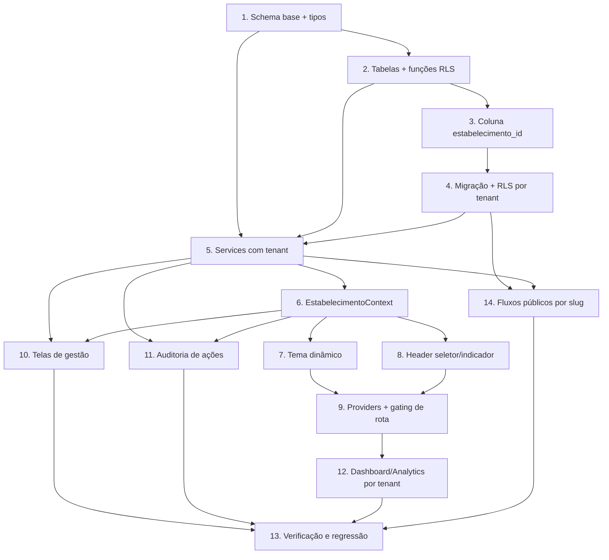

# Implementation Plan

## Overview

Plano incremental para adicionar a camada multi-estabelecimento (multi-tenant) ao sistema "Casa do Pai" (React 19 + Vite + TypeScript + Supabase/PostgreSQL com RLS).

Estratégia: primeiro o banco (tabelas novas, coluna `estabelecimento_id`, funções e políticas RLS, migração), depois a camada de serviços com injeção centralizada de tenant, em seguida o frontend (contexto, tema, header, telas de gestão) e por fim auditoria, dashboard e regressão. A RLS é a fonte de verdade da segurança; o filtro de "estabelecimento atual" no frontend é conveniência. Os scripts SQL seguem a convenção numerada de `BD_20_01 Novo banco - atual/`.

## Tasks

- [x] 1. Consolidar schema base e tipos de tenant
- [x] 1.1 Consolidar scripts SQL avulsos de `stock_items`/`stock_variants`/`stock_movements`/`sales` no schema canônico
  - Reunir as definições divergentes da raiz num único arquivo coerente antes de adicionar tenant
  - Garantir colunas, FKs e RLS base consistentes para essas tabelas
  - _Requirements: 5.1, 11.3_
- [x] 1.2 Criar tipos TypeScript de tenant em `src/types/estabelecimento.ts`
  - `PerfilUsuario`, `Estabelecimento`, `UsuarioEstabelecimento`, `LogAuditoria`
  - _Requirements: 1.1, 2.1, 9.1_

- [x] 2. Criar estrutura de banco multi-tenant (tabelas novas + funções RLS)
- [x] 2.1 Criar `09_estabelecimentos.sql` com as tabelas `estabelecimentos`, `usuarios_estabelecimento` e `logs_auditoria`
  - Incluir constraints: nome único de estabelecimento, CHECK de perfil, CHECK de vínculo obrigatório para perfis não-globais, índice de auditoria
  - _Requirements: 1.1, 2.1, 2.2, 2.3, 9.1, 9.3_
- [x] 2.2 Criar funções `SECURITY DEFINER` `fn_is_admin_geral()` e `fn_estabelecimentos_do_usuario()`
  - `search_path` fixo; evitar recursão de RLS
  - _Requirements: 5.5, 5.6_
- [x] 2.3 Escrever testes de RLS para as funções de autorização
  - Validar conjunto de estabelecimentos retornado por perfil (admin geral = todos; demais = vinculado)
  - _Requirements: 5.5, 5.6_

- [x] 3. Adicionar coluna `estabelecimento_id` às Tabelas_de_Dominio
- [x] 3.1 Criar `10_tenant_columns.sql` adicionando `estabelecimento_id` (NULLABLE) + índice a todas as Tabelas_de_Dominio
  - Tabelas: categorias, produtos, sabores, tamanhos, adicionais, combos, produto_sabores, combo_produtos, pedidos, historico_pedidos, historico_geral, clientes, comandas, historico_comandas, funcionarios, estoque, stock_items, stock_variants, stock_movements, sales, avaliacoes, configuracoes, ia_config, ia_conversas, ia_arquivos_temp
  - _Requirements: 5.1_
- [x] 3.2 Ajustar unicidade de `configuracoes` para `UNIQUE(estabelecimento_id, chave)`
  - Remover a constraint global de `chave`
  - _Requirements: 5.1, 11.1_

- [x] 4. Migração de dados existentes
- [x] 4.1 Criar `11_migracao_dados.sql` idempotente e transacional
  - Criar/reusar Estabelecimento_Padrao; backfill de `estabelecimento_id` onde nulo; vincular usuários de `profile` como `administrador_geral` e `funcionarios` ao padrão
  - _Requirements: 10.1, 10.2, 10.3, 10.5_
- [x] 4.2 Criar `12_tenant_not_null_e_rls.sql` (verificação + NOT NULL + políticas RLS por tenant)
  - Aplicar `SET NOT NULL` somente após verificação de backfill completo; substituir políticas permissivas por políticas por tenant (SELECT/INSERT/UPDATE/DELETE) em todas as Tabelas_de_Dominio
  - _Requirements: 5.3, 5.4, 5.6, 5.7, 10.4, 10.6, 10.7_
- [x] 4.3 Atualizar views e funções de banco existentes para considerar `estabelecimento_id`
  - As ~10 views e ~7 funções passam a projetar/filtrar por estabelecimento
  - _Requirements: 5.8, 5.9_
- [x] 4.4 Escrever testes de isolamento RLS por tabela (cross-tenant)
  - Confirmar Properties 1, 2, 4: leitura vazia e escrita bloqueada fora do tenant autorizado
  - _Requirements: 5.3, 5.4, 5.6, 5.7_

- [x] 5. Camada de serviços com injeção centralizada de tenant
- [x] 5.1 Criar `src/services/tenant.ts` (store leve + helpers `setEstabelecimentoAtivo`, `getEstabelecimentoAtivo`, `fromTenant`, `comTenant`)
  - `comTenant` lança erro quando não há estabelecimento ativo
  - _Requirements: 5.2, 5.8_
- [x] 5.2 Criar `src/services/estabelecimentoService.ts` (CRUD de estabelecimentos)
  - Criar, editar, listar ativos ordenados por nome, ativar/desativar; validar nome (1-100) e cor; tratar duplicidade e falha de persistência
  - _Requirements: 1.2, 1.3, 1.4, 1.5, 1.7, 1.8, 3.1_
- [x] 5.3 Criar `src/services/usuarioService.ts` (CRUD de usuários + Supabase Auth)
  - Criar credencial no Supabase Auth; validar email/nome; rejeitar email duplicado; rollback em falha de Auth; respeitar escopo do admin de estabelecimento
  - _Requirements: 2.3, 2.5, 2.6, 2.7, 2.8, 2.9, 2.10, 2.11_
- [x] 5.4 Criar `src/services/auditoriaService.ts` (registrar + consultar logs)
  - Registro não bloqueante; consulta paginada (≤50) por estabelecimentos autorizados, ordem decrescente
  - _Requirements: 9.1, 9.2, 9.4, 9.5, 9.7_
- [x] 5.5 Adaptar services de domínio para usar o helper de tenant
  - produtoService, categoriaService, saborService, adicionalService, tamanhoService, comboService, pedidoService, historicoPedidoService, clienteService, comandaService, historicoComandaService, estoqueService, stockService, vendaService, avaliacoes, configuracaoService — aplicar `comTenant` em insert e filtro de `estabelecimento_id` em select/update; ajustar filtro de realtime de pedidos
  - _Requirements: 5.2, 5.3, 5.4, 11.1, 11.2_
- [x] 5.6 Escrever testes unitários do helper de tenant e de um service adaptado
  - Confirmar Property 3 e 7: insert sem estabelecimento falha; select aplica `.eq`
  - _Requirements: 5.2, 5.8_

- [x] 6. Contexto de estabelecimento (frontend)
- [x] 6.1 Criar `src/contexts/EstabelecimentoContext.tsx` (Provider + `useEstabelecimento`)
  - Carregar autorizados por perfil; definir atual (último usado p/ admin geral, vinculado p/ demais); `trocarEstabelecimento`; sincronizar `setEstabelecimentoAtivo`; estados de loading/erro
  - _Requirements: 3.3, 3.4, 3.8, 4.3, 4.4, 4.5, 4.6_
- [x] 6.2 Implementar persistência do último estabelecimento
  - Upsert de `ultimo_estabelecimento_id`; tratar falha de persistência sem perder a sessão
  - _Requirements: 4.1, 4.2_
- [x] 6.3 Registrar auditoria na troca de estabelecimento
  - Gravar log com origem/destino ao trocar
  - _Requirements: 9.2_
- [x] 6.4 Atualizar `usePermissoes` para expor `perfil` e `estabelecimento_id`
  - Ler de `usuarios_estabelecimento` com fallback para `profile`/`funcionarios`; novas flags de gestão
  - _Requirements: 2.2, 2.8, 2.9_
- [x] 6.5 Escrever testes do `EstabelecimentoProvider`
  - Seleção inicial por perfil, troca, persistência, estado sem estabelecimento ativo
  - _Requirements: 3.3, 4.3, 4.4, 4.5, 4.6_

- [x] 7. Tema dinâmico por estabelecimento
- [x] 7.1 Criar utilitário `src/utils/cor.ts` (hex → oklch + validação)
  - Detectar cor inválida para acionar fallback
  - _Requirements: 6.3, 6.5_
- [x] 7.2 Criar `src/contexts/TemaEstabelecimentoContext.tsx` (Provider)
  - Injetar variáveis CSS no `:root` (--primary, --ring, --sidebar-primary, --chart-*, --admin-btn-primary-bg, --price-color) ao mudar o atual; aplicar antes de exibir dados; fallback de tema padrão
  - _Requirements: 6.1, 6.2, 6.4, 6.5, 6.6_
- [x] 7.3 Escrever testes do tema (aplicação e fallback)
  - Confirmar Property 8
  - _Requirements: 6.1, 6.5_

- [x] 8. Header: seletor e indicador de estabelecimento
- [x] 8.1 Criar `src/components/estabelecimento/SeletorEstabelecimento.tsx`
  - Admin geral: lista ativa ordenada + estado vazio; demais perfis: somente leitura
  - _Requirements: 3.1, 3.2, 3.3, 3.4_
- [x] 8.2 Criar `src/components/estabelecimento/IndicadorEstabelecimento.tsx`
  - Nome + cor do atual; estado "nenhum selecionado"; atualização ao trocar
  - _Requirements: 7.1, 7.2, 7.3, 7.4, 7.5_
- [x] 8.3 Integrar seletor e indicador no `AppLayout` e `MobileAdminHeader`
  - Header fixo visível em todas as telas
  - _Requirements: 7.1_
- [x] 8.4 Tratar erro de recarga ao trocar (manter atual + retry)
  - _Requirements: 3.6_

- [x] 9. Integrar providers e gating de rota
- [x] 9.1 Compor `EstabelecimentoProvider` e `TemaEstabelecimentoProvider` dentro de `ProtectedRoute`/`AdminSystem` em `src/App.tsx`
  - _Requirements: 3.4, 6.4, 11.4_
- [x] 9.2 Bloquear dados de domínio sem estabelecimento selecionado/vinculado
  - Exibir solicitação de seleção; preservar sessão
  - _Requirements: 4.6, 11.4, 11.5_
- [x] 9.3 Forçar recálculo das páginas ao trocar (chave de tenant)
  - Usar valor de tenant como dependência/`key`
  - _Requirements: 3.5, 8.3_

- [x] 10. Telas de gestão (Estabelecimentos, Usuários, Auditoria)
- [x] 10.1 Criar página `src/pages/Estabelecimentos.tsx` + formulário (CRUD)
  - Restrita a admin geral; validações e mensagens de erro
  - _Requirements: 1.2, 1.3, 1.4, 1.5, 1.6, 1.7, 1.8_
- [x] 10.2 Criar página `src/pages/Usuarios.tsx` + formulário (CRUD)
  - Campos nome/email/senha/ativo/estabelecimento/perfil; escopo por perfil
  - _Requirements: 2.1, 2.3, 2.6, 2.7, 2.8, 2.9, 2.10, 2.11_
- [x] 10.3 Criar página `src/pages/Auditoria.tsx` (consulta paginada)
  - Filtra por estabelecimentos autorizados; nega acesso a perfis não autorizados
  - _Requirements: 9.4, 9.5, 9.8_
- [x] 10.4 Adicionar itens de menu e rotas em `AppLayout`/`AdminSystem`, filtrados por perfil
  - Configurações > Usuários; Estabelecimentos; Auditoria
  - _Requirements: 1.6, 2.9_

- [x] 11. Auditoria das ações operacionais
- [x] 11.1 Instrumentar ações relevantes (cadastro/alteração/exclusão/venda/finalização/cancelamento) para registrar auditoria
  - Descrição legível (ex: "Maria alterou produto X no Prédio CIC"); não bloqueante
  - _Requirements: 9.1, 9.3, 9.7_

- [x] 12. Dashboard, métricas e analytics por estabelecimento
- [x] 12.1 Garantir que Dashboard, Métricas e Analytics filtrem pelo estabelecimento atual
  - Cards e indicadores; estados vazio/zero e erro por card; recálculo ao trocar
  - _Requirements: 8.1, 8.2, 8.3, 8.4, 8.5, 8.6_

- [x] 13. Verificação final e regressão
- [x] 13.1 Rodar build (`npm run build`) e suíte de testes (`npm run test:run`)
  - _Requirements: 11.1, 11.2_
- [x] 13.2 Smoke test dos fluxos existentes com um estabelecimento ativo (produtos, PDV, comandas, pedidos)
  - Confirmar paridade de comportamento dentro do escopo do tenant
  - _Requirements: 11.1, 11.2, 11.3_

- [x] 14. Fluxos públicos por slug (delivery, cardápio, avaliação)
- [x] 14.1 Adicionar coluna `slug` única em `estabelecimentos` (DDL + backfill do padrão)
  - Atualizar `09_estabelecimentos.sql` e a migração para gerar slug do Estabelecimento_Padrao
  - _Requirements: 11.1_
- [x] 14.2 Criar `EstabelecimentoPublicoProvider` que resolve o estabelecimento pelo slug da rota
  - Define o tenant para queries anônimas; trata slug inexistente/inativo
  - _Requirements: 5.2, 5.3, 11.4_
- [x] 14.3 Adicionar rotas com slug e ajustar páginas públicas (`/:slug`, `/:slug/checkout`, `/:slug/avaliar`)
  - Raiz `/` sem slug: seleção de prédio ou redirecionar ao slug padrão
  - _Requirements: 11.1, 11.2_
- [x] 14.4 Escopar leitura anônima do catálogo e inserts públicos ao estabelecimento do slug
  - RLS de leitura anônima por estabelecimento; injetar `estabelecimento_id` em `pedidos`/`clientes`/`avaliacoes` públicos
  - _Requirements: 5.2, 5.3, 5.7_

## Task Dependency Graph



```json
{
  "waves": [
    { "wave": 1, "tasks": ["1.1", "1.2"] },
    { "wave": 2, "tasks": ["2.1", "2.2", "2.3"] },
    { "wave": 3, "tasks": ["3.1", "3.2"] },
    { "wave": 4, "tasks": ["4.1", "4.2", "4.3", "4.4"] },
    { "wave": 5, "tasks": ["5.1", "5.2", "5.3", "5.4", "5.5", "5.6"] },
    { "wave": 6, "tasks": ["6.1", "6.2", "6.3", "6.4", "6.5"] },
    { "wave": 7, "tasks": ["7.1", "7.2", "7.3", "8.1", "8.2"] },
    { "wave": 8, "tasks": ["8.3", "8.4", "9.1", "9.2", "9.3", "10.1", "10.2", "10.3", "10.4", "11.1"] },
    { "wave": 9, "tasks": ["12.1", "14.1", "14.2", "14.3", "14.4"] },
    { "wave": 10, "tasks": ["13.1", "13.2"] }
  ]
}
```

## Notes

- A camada de banco (tarefas 1-4) é pré-requisito de todo o restante: sem `estabelecimento_id` e RLS, os services e o frontend não têm o que filtrar.
- Ponto de decisão em aberto (ver design): páginas públicas de delivery/avaliação precisam definir o estabelecimento (slug por prédio vs. estabelecimento público padrão). Confirmar com o usuário antes de implementar os fluxos públicos — não coberto explicitamente nas tarefas acima por depender dessa decisão.
- As tarefas de teste de RLS (2.3, 4.4) exigem um banco Supabase de teste; podem ser executadas via SQL/integração.
- Tarefas marcadas com escrita de testes validam as Correctness Properties do design.


